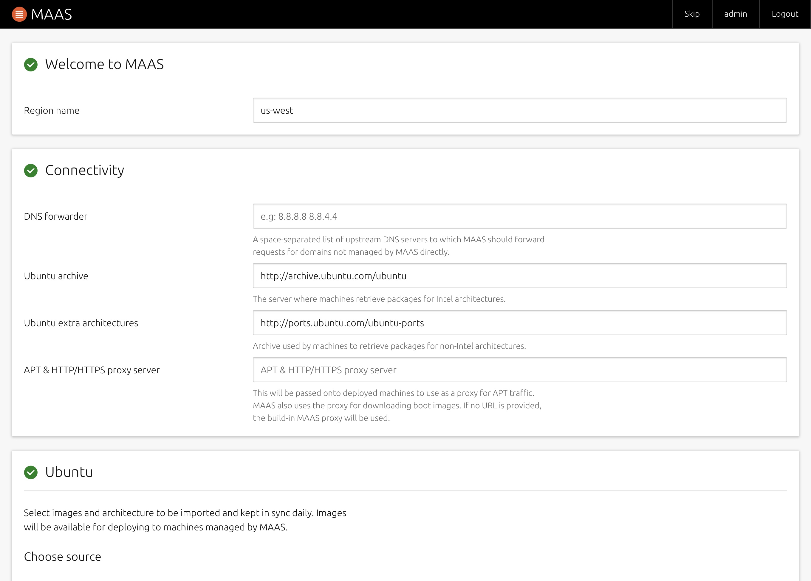
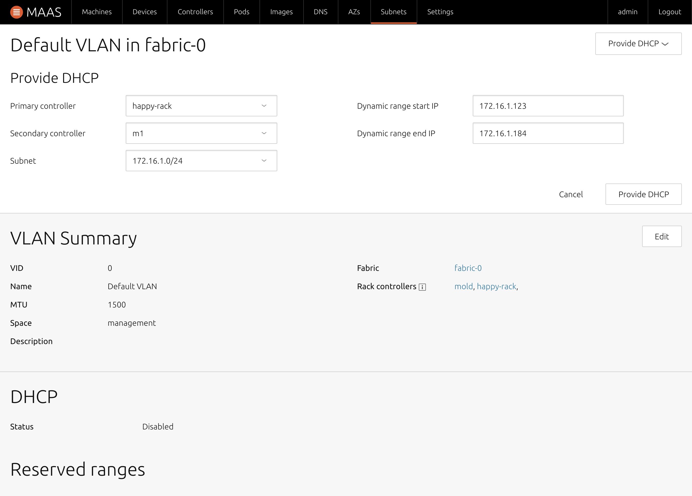
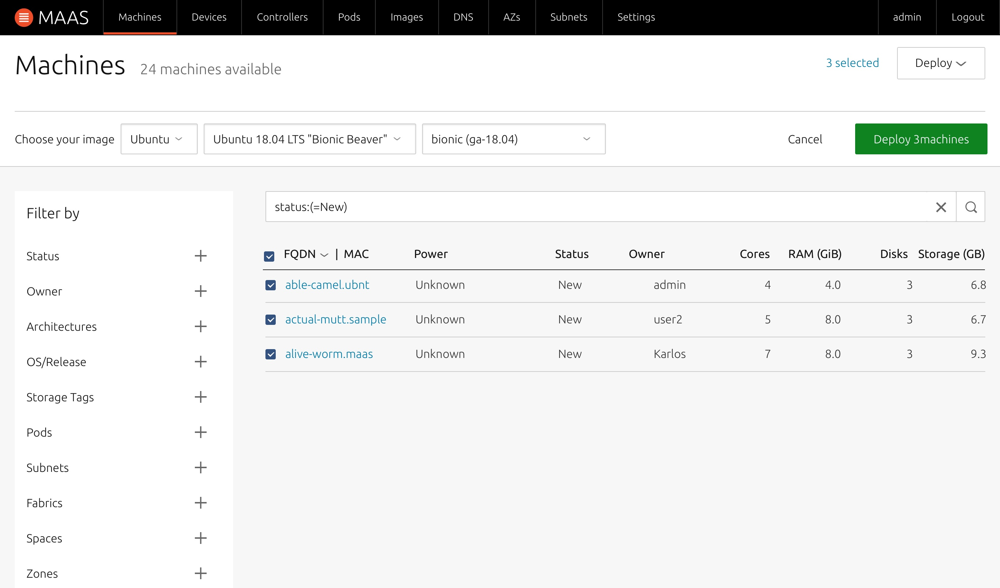

# MAAS 使用

## 使用步骤

### 准备 MAAS 服务器

#### 安装 Ubuntu server 18.04

MAAS 的最新版本一般与 Ubuntu 的最新版本绑定。

所以目前建议部署的操作系统为 Ubuntu 18.04

#### 安装 MAAS

一般没有特殊要求，我们会将 maas 的管理和控制器安装在同一节点上。安装步骤如下：

```shell
sudo apt update
sudo apt install maas -y
```

#### 初始化 MAAS

安装结束后，需要创建初始用户才能开始使用

```shell
sudo maas init
```

输入用户名，密码，邮箱等信息。密钥部分可以直接跳过等待后面再输入。

#### 第一次登陆设置

访问 MAAS 地址为

```url
http://<your.maas.ip>:5240/MAAS/
```



在此需要设置的选项主要有：

1. Region name (MAAS name)
2. Ubuntu archive, Ubuntu extra architectures 这是两个软件仓库
3. MAAS 需要下载的镜像选择。这里一般包含 Ubuntu 和 CentOS 两个系列。
4. SSH keys

#### 设置 MAAS 网络


在这里设置 MAAS 服务器需要管理的网络信息。

#### 设置 DHCP



这里的 DHCP 有两种模式，提供服务模式和客户端模式。

#### 添加服务器

将服务器设置为 PXE 启动。 MAAS 服务器会自动给服务器分配地址安装必要的启动程序，接管服务器的启动。

在 MAAS 接管服务器后，服务会出现在下面的列表中。状态一栏显示 NEW。



#### 初始化服务器


在初始化结束后，服务器的状态将变为 READY，表示服务器可以安装操作系统了。

#### 给服务器安装操作系统


## 问题及对策

### 遇到操作正常，但依旧错误的问题怎么处理？

升级到软件仓库中的最新版本。一般这类问题可以解决。

#### 无法 PXE 启动怎么办？

请进入主板的 BIOS 设置。检查系统的启动顺序，同时查看系统系否可以识别相关的网卡启动方式。